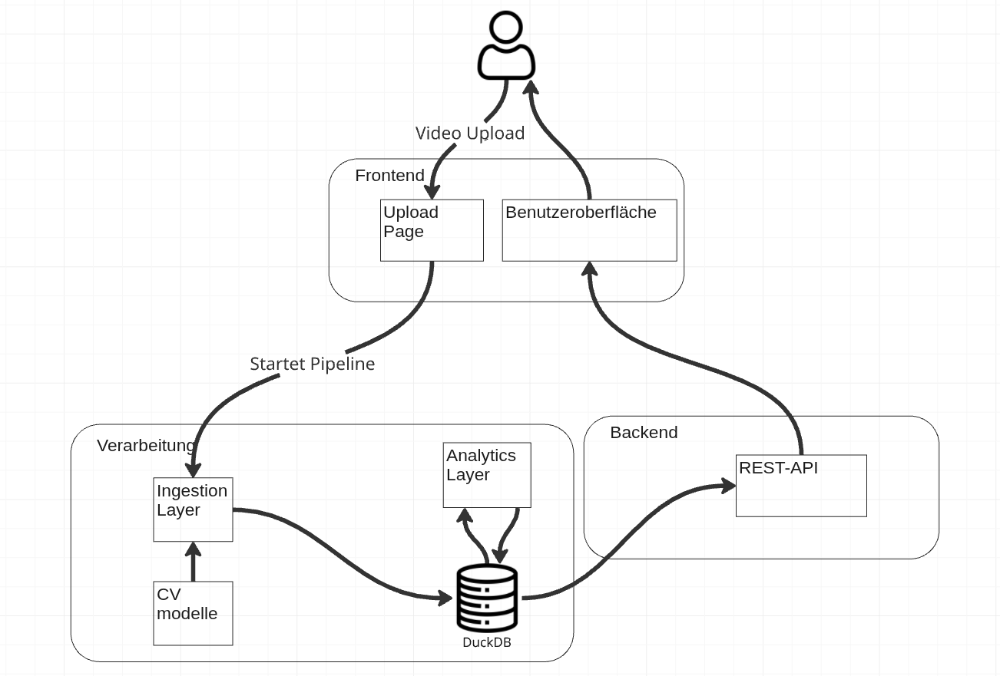
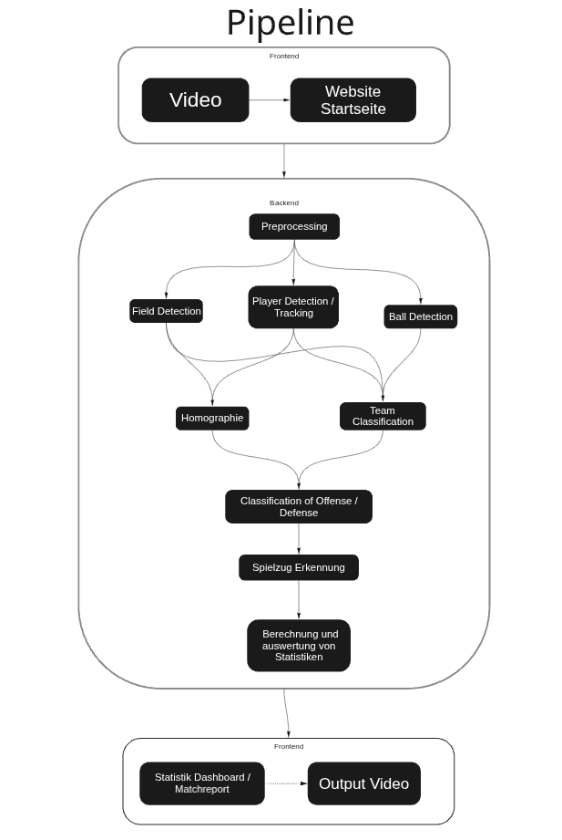

  

  <h1>WELS — Handball-Analyseplattform</h1>

  
<strong>Spielvideo hochladen. Die Analyse, die sonst ein ganzes Trainerteam liefert — automatisch.</strong>

---

## Worum geht es?

WELS macht aus einer einzigen Aufnahme eines Handballspiels strukturierte, durchsuchbare
Erkenntnisse. Kamera auf das Spielfeld richten, Video hochladen — eine Computer-Vision-Pipeline
verfolgt jeden Spieler und den Ball, erkennt die Teams und rekonstruiert Bild für Bild, was auf
dem Feld passiert ist, ganz ohne manuelles Markieren der Aufnahme.

Das Ergebnis erscheint in einem Web-Dashboard, das für **Trainer und Analysten** gemacht ist —
nicht für Entwickler.

## Was es abdeckt

- **Automatische Spielerfassung** — einfach ein MP4 hochladen, keine manuelle Annotation nötig
- **Spieler- & Ball-Tracking** — jeder Spieler über das gesamte Spiel verfolgt und auf Feldkoordinaten abgebildet
- **Team-Erkennung** — Spieler werden automatisch ihren beiden Teams zugeordnet
- **Heatmaps** — wo jedes Team sich auf dem Feld aufgehalten und welche Zonen es dominiert hat
- **Formationserkennung** — erkennt die Abwehr- und Angriffsformationen beider Teams
- **Ballbesitz & Phasen** — wer den Ball hatte und wie das Spiel zwischen den Phasen wechselte
- **Aktions-Insights** — Würfe, Trefferquoten und Spielstand, pro Spiel aufbereitet
- **Spielbibliothek** — jedes analysierte Spiel an einem Ort, jederzeit erneut abrufbar und vergleichbar

## Der Mehrwert für Trainer

| Ohne WELS | Mit WELS |
|-----------|----------|
| Stundenlanges Sichten und manuelles Taggen von Clips | Einmal hochladen — die Analyse wird für dich berechnet |
| Bauchgefühl zu Positionierung und Raumaufteilung | Objektive Heatmaps und Formationslabels pro Team |
| „Ich glaube, wir haben die zweite Halbzeit im Umschaltspiel verloren" | Ballbesitz- und Phasendaten, die genau zeigen, wo |
| Notizen verstreut über Hefte und Geräte | Ein Dashboard mit der kompletten Historie deiner Spiele |

Der Punkt ist einfach: **weniger Zeit vor dem Rohmaterial, mehr Zeit für das Coaching.** WELS
übernimmt das Sichten und die Buchführung, damit das Trainerteam sich auf Entscheidungen
konzentrieren kann.

## Architektur der Plattform

Frontend, eine Verarbeitungseinheit mit Ingestion- und Analyse-Layer, eine DuckDB als zentrale
Datenhaltung und ein REST-Backend — und wie alles zusammenspielt:

## Aufbau der Pipeline

Welche Schritte ein Spielvideo von der Aufnahme bis zur fertigen Analyse durchläuft:

## Dokumentation

Die vollständige technische Dokumentation — Setup, die Computer-Vision- und ML-Pipeline, das
Datenmodell und das Deployment — liegt als **Confluence-PDF-Export** unter
[`assets/Dokumentation.pdf`](assets/Dokumentation.pdf).

---

  sportsvision · Handball Computer Vision Analytics

